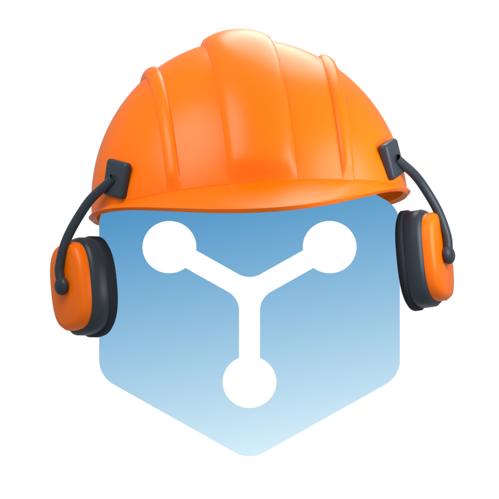

# Construction logo source

For switchable accessories, open [the configurable model](fluxzero-helmet-configurable.blend).
The short front peak is the selected design. Its Collections keep the ear defenders
separately editable and switchable; they are enabled by default.
See [variants and controls](variants/README.md).

`fluxzero-helmet.blend` is the editable 3D source for the dev-server logo.
It contains the original Fluxzero curves, a solid helmet with longitudinal ribs,
a front peak, ear defenders and mirrored mounts, an orthographic camera and
three area lights.
There are no external textures or add-on dependencies. Open it in Blender to
inspect or adjust the model.



The selected vector is [logo.svg](logo.svg). The same SVG is used by the
application sidebar and favicon at `frontend/public/assets/fluxzero-devserver-logo.svg`.

The mark faces the camera; only the helmet is posed. The shell and hardware
are mirrored. Both cushions retain their rounded, uncompressed shape. The right
cushion is thinner; its ear cup sits inward and forward against the logo corner.
The helmet's pose is -10° about X, -4° about Y and 8° about Z, at Z = 1.50. The far mount's
visibility follows from the geometry. The blue gradient and the white symbol
follow the existing dev-server branding. The original two SVG path definitions
are copied verbatim to the production SVG.

## Rebuild

Use Blender 5.2.1 LTS. Run from the repository root:

```sh
blender --background --factory-startup --python-exit-code 1 \
  --python design/devserver-logo/build_model.py
blender --background design/devserver-logo/fluxzero-helmet.blend \
  --python-exit-code 1 --python design/devserver-logo/render_passes.py
python3 -m venv design/devserver-logo/.venv
design/devserver-logo/.venv/bin/python -m pip install \
  -r design/devserver-logo/requirements.txt
OPENBLAS_NUM_THREADS=1 OMP_NUM_THREADS=1 \
  design/devserver-logo/.venv/bin/python design/devserver-logo/trace_svg.py
blender --background --factory-startup --python-exit-code 1 \
  --python design/devserver-logo/build_configurable.py
```

On macOS the Blender executable is also available at
`/Applications/Blender.app/Contents/MacOS/Blender`.
The default render is transparent, 1000 × 1000 px, with 96 Cycles samples.
The orthographic frame is 8.8 units wide, centred at Z = 0.7 to fit the taller
crown. Keep the matching projection in `trace_svg.py` aligned when changing
these camera parameters.
The default build produces the selected front peak with ear defenders.
`build_model.py` accepts `--resolution`, `--samples` and `--output` after `--`.
Edit the dimensions and `helmet.rotation_euler` in that script to change the
model. The alternate view in `perspective-check.png` is for inspecting its depth.

`render_passes.py` derives visible surfaces and occlusion from the saved model.
Material IDs use unmixed label samples. SVG shading is clipped to the visible
geometry, with separate orange and dark backing to avoid colored seams.
`trace_svg.py` simplifies the visible contours and fits reusable SVG gradients
to their lighting. Review `projected-logo.svg` against `render.png`, including
16, 32, 44 and 80 px previews, before copying it to:

```
frontend/public/assets/fluxzero-devserver-logo.svg
```

Both the page logo and favicon use that asset. Blender and the Python packages
are design tools only and are not required to build or run the dev server.

The SVG preserves the silhouette and brand geometry, with simplified lighting.
It is intentionally not a pixel-identical copy of Cycles shading: fine reflections,
soft shadows and rounded bevel transitions are reduced to a small set of
vector shapes and gradients. There are no embedded bitmaps or fonts.
